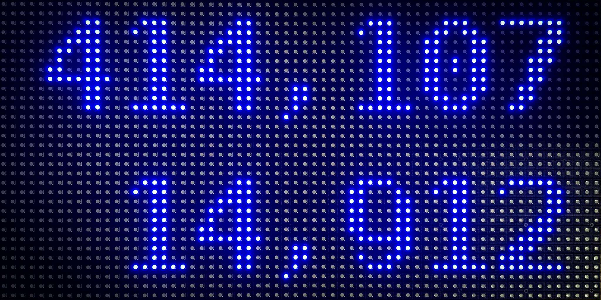
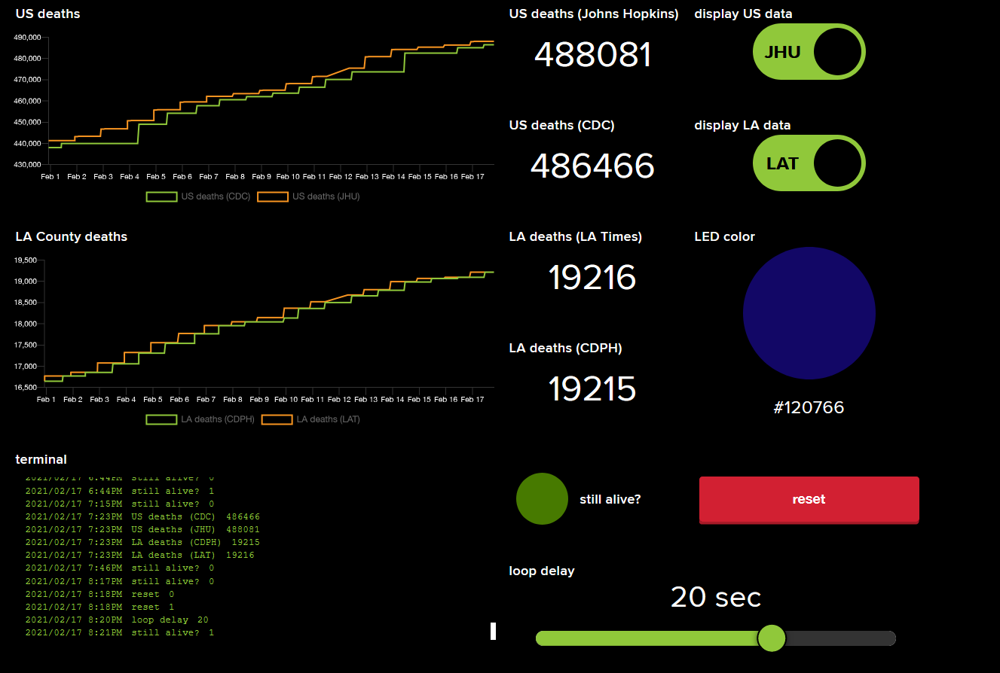

# covidticker


_How many people have died in the United States and in Los Angeles county during the COVID-19 pandemic?_ Every hour, fetch the data and display it on a wall-mounted LED display ticker.  



A [Python script](https://github.com/perryrothjohnson/covidticker/blob/main/covidticker.py) pulls data from the following sources:  
- US deaths  
  - [CSSEGISandData/COVID-19](https://github.com/CSSEGISandData/COVID-19) by Johns Hopkins University Center for Systems Science and Engineering  
  - [Centers for Disease Control (CDC)](https://data.cdc.gov/Case-Surveillance/United-States-COVID-19-Cases-and-Deaths-by-State-o/9mfq-cb36)  
- LA County deaths  
  - [datadesk/california-coronavirus-data](https://github.com/datadesk/california-coronavirus-data) by The Los Angeles Times  
  - [California Department of Public Health (CDPH)](https://data.ca.gov/dataset/covid-19-cases/resource/926fd08f-cc91-4828-af38-bd45de97f8c3)

The data is recorded on [Adafruit IO](https://io.adafruit.com/) and is updated hourly using a [scheduled GitHub Action](https://github.com/perryrothjohnson/covidticker/blob/main/.github/workflows/scheduled.yml). Johns Hopkins and LA Times are the primary data sources for US and LA county deaths, respectively. Their figures are typically ahead of the data published by the CDC and CDPH. However, we collect CDC and CDPH data for comparison, and as backups for display on the ticker.



Code written in [CircuitPython](https://circuitpython.org/) runs on an [Adafruit Matrix Portal](https://www.adafruit.com/product/4745) circuit board, powered by [USB-C](https://www.adafruit.com/product/4298). The Matrix Portal uses the [MQTT protocol](https://learn.adafruit.com/mqtt-in-circuitpython/overview) to receive data posted on [Adafruit IO](https://io.adafruit.com/). It is connected to an [RGB LED matrix](https://www.adafruit.com/product/2276), which serves as the LED display ticker.

## Adafruit IO feeds

If you don't already have one, you'll also need to setup an Adafruit IO account with the following feeds. The first 4 feeds store the US and LA county deaths from a [scheduled GitHub Action](https://github.com/perryrothjohnson/covidticker/blob/main/.github/workflows/scheduled.yml).  The next 4 feeds can be controlled from a dashboard (pictured above) to change the LED display's appearance or performance. The final 2 feeds monitor the LED display for crashes and errors.

| feed name        | key              | description                                                                         |
| :--------------- | :--------------- | :---------------------------------------------------------------------------------- |
| US deaths (JHU)  | `us-deaths-jhu`  | COVID-19 deaths in the United States, according to Johns Hopkins University         |
| US deaths (CDC)  | `us-deaths-cdc`  | COVID-19 deaths in the United States, according to the CDC                          |
| LA deaths (LAT)  | `la-deaths-lat`  | COVID-19 deaths in Los Angeles County, according to the LA Times                    |
| LA deaths (CDPH) | `la-deaths-cdph` | COVID-19 deaths in Los Angeles County, according to the CA Dept of Public Health    |
| JHU-CDC          | `jhu-cdc`        | toggle US data source between Johns Hopkins or Centers for Disease Control          |
| LAT-CDPH         | `lat-cdph`       | toggle LA county data source between LA Times or CA Dept of Public Health           |
| LED color        | `led-color`      | choose a text color for the LED matrix display                                      |
| loop delay       | `loop-delay`     | how many seconds to wait between executions of the main loop?                       |
| still alive?     | `still-alive`    | if 1: LED display is still alive; if 0 (for a long time): it has crashed            |
| reset            | `reset`          | reset button to manually reconnect LED display to Adafruit IO server                |

### Webhooks

The [Python script](https://github.com/perryrothjohnson/covidticker/blob/main/covidticker.py) publishes data to Adafruit IO using webhooks. You'll need to generate your own unique webhook URLs for the first 4 feeds listed above, and replace the URLs in each of the `requests.post()` calls in the `send_data()` method. For example, the `us-deaths-jhu` feed would look like this:
```python
requests.post('[INSERT WEBHOOK URL HERE]', json={'value': us_jhu})
```
More information is available in [the docs](https://io.adafruit.com/api/docs/#send-data-via-webhook) and [this blog post](https://io.adafruit.com/blog/notebook/2018/11/26/feed-webhooks/).

## Hardware required

- [Adafruit Matrix Portal - CircuitPython Powered Internet Display](https://www.adafruit.com/product/4745)  
- [64x32 RGB LED Matrix - 6mm pitch](https://www.adafruit.com/product/2276) (Note: if you don't need something this big, other 64x32 displays with smaller spacing between pixels (i.e., pitch) should also work: [5mm](https://www.adafruit.com/products/2277), [4mm](https://www.adafruit.com/products/2278), or [3mm](https://www.adafruit.com/products/2279))  
- [Official Raspberry Pi Power Supply 5.1V 3A with USB C - 1.5 meter long](https://www.adafruit.com/product/4298) (or similar USB-C power supply)

## Usage

1. [Install CircuitPython on your Matrix Portal board](https://learn.adafruit.com/matrix-portal-new-guide-scroller/install-circuitpython). Also see detailed instructions [here](https://learn.adafruit.com/welcome-to-circuitpython/installing-circuitpython).  
2. Copy the files from the [**matrixportal**](https://github.com/perryrothjohnson/covidticker/tree/main/matrixportal) folder onto the **CIRCUITPY** volume on your Matrix Portal board.  
3. Create a **secrets.py** file on the **CIRCUITPY** volume. Follow [these instructions](https://learn.adafruit.com/matrix-portal-new-guide-scroller/code-the-matrix-portal#secrets-setup-3075853-4) to save your private logins for WiFi and for Adafruit IO in **secrets.py**. (Note: if you don't want to store your WiFi password in plaintext, you can use the **wpa_passphrase** utility to store an encrypted hash of your password instead. See the _Adding the network details to the Raspberry Pi_ section in [this page](https://www.raspberrypi.org/documentation/configuration/wireless/wireless-cli.md) for instructions.)  
4. Use the [Mu editor](https://learn.adafruit.com/welcome-to-circuitpython/installing-mu-editor) to test if the code is working. Activate the [serial console](https://learn.adafruit.com/welcome-to-circuitpython/interacting-with-the-serial-console) to see any **print()** statements on your screen.  
5. Connect the Matrix Portal board to your LED matrix display. Plug a USB-C power supply into the Matrix Portal to turn it on.

## Acknowledgements

This project was heavily inspired by these projects:  
- Adafruit: [Matrix Portal New Guide Scroller](https://learn.adafruit.com/matrix-portal-new-guide-scroller/overview)  
- Hackaday: [Stay Informed: How To Pull Your Own COVID-19 Data](https://hackaday.com/2020/03/26/stay-informed-how-to-pull-your-own-covid-19-data/)  
- [simonw/covid-19-datasette](https://github.com/simonw/covid-19-datasette), deploys an API to [https://covid-19.datasettes.com/](https://covid-19.datasettes.com/) with JHU & LA Times data
- [julianbruegger/corona-display](https://github.com/julianbruegger/corona-display), an LCD ticker run by a Raspberry Pi  
- Adafruit: [Network Connected RGB Matrix Clock](https://learn.adafruit.com/network-connected-metro-rgb-matrix-clock/overview)  
- Adafruit: [Tombstone Matrix Portal](https://learn.adafruit.com/tombstone-matrix-portal/overview)  
